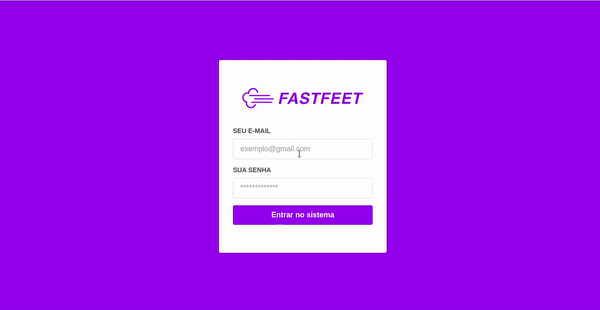

<h1 align="center">
  <p></p>
</h1>

<h1 align="center">
  <p align="center">
    
    
  </p>
</h1>

# Summary
 - [About](#-fastfeet)
 - [Features](#-features)
 - [Techs](#-techs)
 - [Back end](#-instructions-backend)
 - [Front end](#-instructions-frontend)
 - [Mobile](#-instructions-mobile)

---
FastFeet is an application developed for a fictitious carrier. It allows you to manage deliverers, recipients, orders, report problems with deliveries, among other features. In addition, it sends emails for orders ready to be withdrawn or canceled.

You can check out the <a href="./backend/docs.md" rel="noopener noreferrer">docs</a> to look at the <i>endpoints</i>.

---

## ✨ Features

- CRUD Administrators
- CRUD Deliverers
 - Pickup and Delivery Confirmation
 - Upload and Delete of files
- CRUD Orders
 - Orders can only be picked up between 8 am and 6 pm
 - Each delivery person can pick up to 5 orders per day
- Register of problems at deliveries
- Cancellation deliveries

---

## ⚙ Techs

 - ReactJS
 - Node.js
 - Postgres
 - Redis
 - Sequelize
 - Styled-Components
 - Redux/Sagas
 - React Native (0.62.1)
 - React Native Camera
 - Nodemailer
 - Multer

---

> To run the project, before everything you need to clone this repository
```bash
  git clone https://github.com/giangr21/fastfeet
```

---

## 💻 Instructions Backend

You will need in your machine **Node.js**,  **Yarn** and **Docker**. 

 - Run `yarn` to download all the dependencies needed to execute the project;

 - Lets install two images of two databases: Postgres, to storage our tables and Redis, a extremely perfomatic database that will send our emails with queues .
    ```bash
      # do a container with postgres image
      docker run --name postgres -e POSTGRES_PASSWORD=postgres -p 5432:5432 -d postgres

      # do a container with redis image
      docker run --name redis -p 6379:6379 -d -t redis:alpine
    ```
 - Run `yarn queue` to start the queue of the emails.

 - Run the `migrations` to create all the tables necessary for our application.
	  ```
   yarn sequelize db:migrate
   ```

 - Run the `seeds` to get the initial data of our application:
   ```
   yarn sequelize db:seed:all
   ```
   *Now you will have a  admin user with the email admin@fastfeet.com and password 123456 to do the auth login.*

  - In the root of the project, create a `.env` file and fill the informations according with the example `.env.example`;

 - After that, run `yarn dev` to start the backend.

---

## 💻 Instructions frontend

 - Run `yarn` to download all the dependencies needed to execute the project.

 - After that, run `yarn start` to start the frontend.

---

## 📱 Instruções para o mobile
 > The project was focused for Android devices.
 
 - Run `yarn` to download all the dependencies needed to execute the project.

 - After that,  if it is your first execution run `yarn android`.  Or `yarn start` to start the app;

---
